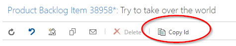

## Synopsis

Add a simple "Copy Id" button to all work items.  The button will copy the Id(s) of the selected work item(s) to the user's clipboard.

## Motivation

For quicker sharing of a work item Id in Slack, etc.
